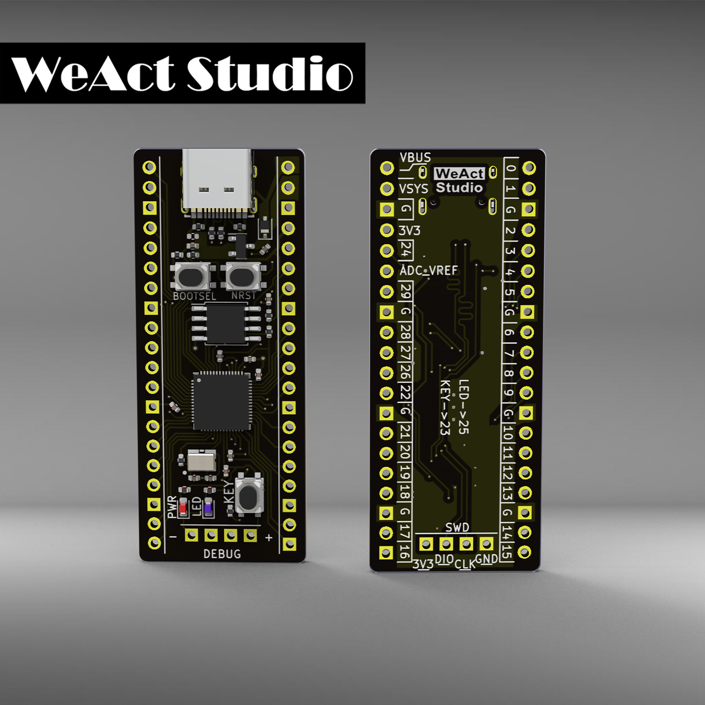
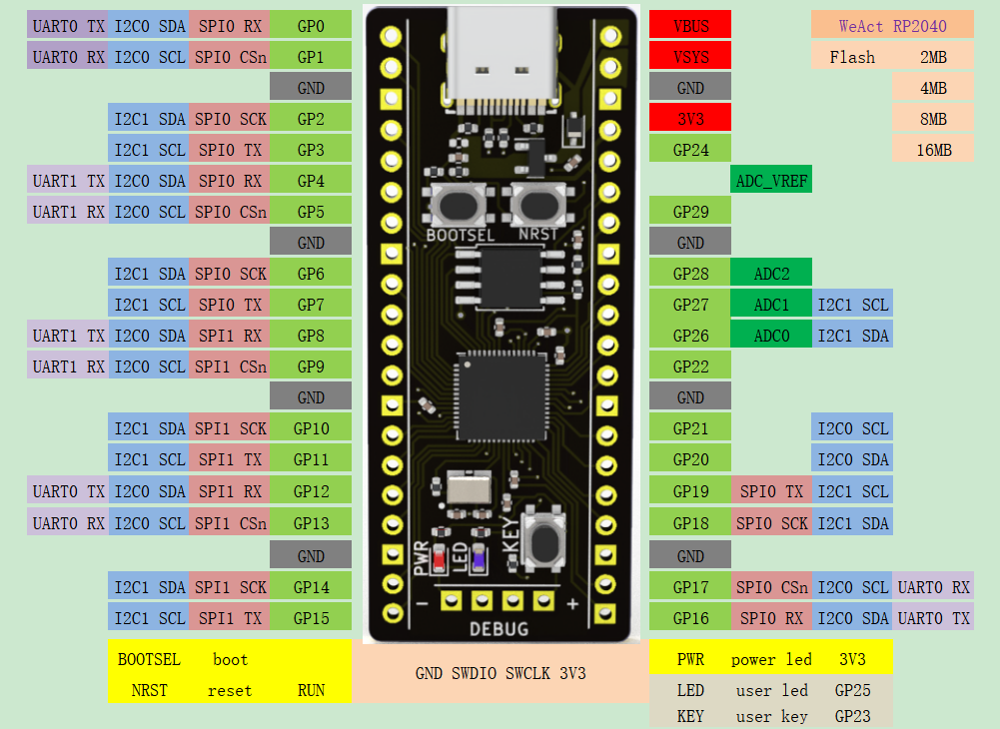

# RP2040 / WeAct Studio 微行工作室 出品

#### WeAct-RP2040-V1.0  介绍

RP2040支持Micropython、C、Arduino开发;
RaspberryPi Pico是一款低成本，高性能的微控制器开发板，具有灵活数字接口;
硬件上，采用Raspberry Pi官方自主研发的RP2040微控制器芯片，搭载了ARM Cortex MO +双核处理器，高达133MHz的运行频率，内置了264KB的SRAM和外置2MB、4MB、8MB、16MB四种内存可选；

外形图：

引脚图：

尺寸图：

